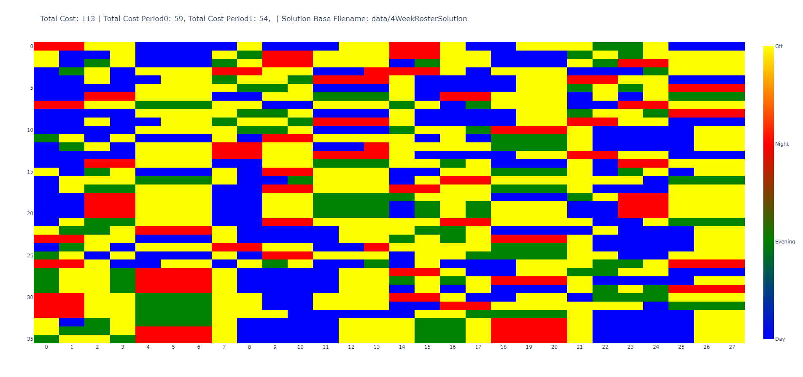

# pyNspPattern

Solves the Nurse Scheduling Problem (NSP) with 1-week and 2-week patterns generated up front. The solution is optimized over 2 weeks and patched together with next 2 weeks using the former as starting conditions.

Furthermore, a Column Generation algorithm is implemented
to speed up the solution process if needed.

## Installation
I have used Python 3.10, but this might work with other versions as well.

I recommend using a virtual environment to install the required packages. To do so, run the following commands:

```bash pip install -r requirements.txt```

## Usage
The main file is `main.py`. To run the program, simply run the following command:

```bash python main.py```

0r go into `main.py` and play around with the parameters. You can calculate any even numbered plan either using a full 
solution or a column generation algorithm,  where you specify how long time you want to run it for each 2-week period.

The more static input parameters such as nurse demand and supply and number of shift types are stored in input_parameters.py.

## How it works
The program is based of my original work from my [Thesis from 2017 at DTU](https://www.dropbox.com/s/p2memkka1tygggx/Main%20Thesis%20File.pdf?dl=0) working together with Riget to optimize their nurse scheduling.
Although at the time I never got Column Generation (CG) to work properly, I decided to give it another shot with patterns generated up too front instead, which turns out to be quite effective.

There are some slight changes to the CG model from the thesis. For instance, I only use 4 shifts types Off, Day, Evening and Night, instead of 7 that I used in the thesis where it was Off + Day, Evening and Night for each nurse competence level (1 and 3).

This change made it possible to generate all rosters up front working with a 2-week period, and then I investigated how I could patch these together.

Further explanation and some results can be found in this [Google Sheet Presentation](https://docs.google.com/presentation/d/1Sd_SwZE5Q46sYWflUblwJZJwTlvCniZiViLc7QHK9A8/edit?usp=sharing).

## Results
The speed of the program is the most impressive part. It can generate 2*n-week schedule for more than 55 nurses in less than n*5 seconds using Column Generation (a 20 pct gap from optimal solution).
Or it can find the near optimal solution in n * 3 minutes roughly.

I created code to make plotly plots to visualize the results. Here are some examples of a 4-Weeks schedule:




[Visualizations in interactive html format](https://ec0di.github.io/pyNspPattern/index.html)


## To implement this in real scenarios
First of all, there are some limitations to the model. We are taking advantage of only having 4 shifts types, which is not always the case. If the space of possible rosters become to large, this model won't work.

Secondly, the constraints and objective measures of the model can vary from department to department. These would to be tweaked and perhaps made more generic, so a config file with constraints and objective measures could be supplied for each department.

Furthermore, more development would have to be done to include features such as
* Input 2 weeks current schedule for all nurses as starting condition (this is already possible, just need a UI in Excel or similar for this)
* Specific requests for specific shifts on day (e.g. day off on the first Thursday) and not a specific shift on day (e.g. not a evening shift on second Friday).
* Holiday periods as part of plans.

One could perhaps also use this as a simulation tool to get inspiration of how the patterns and a combined schedule could look like.
